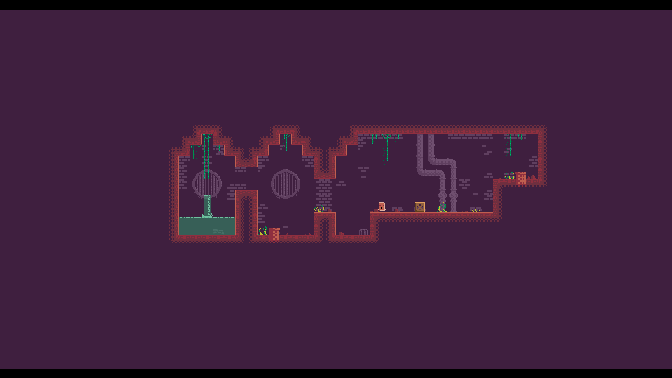
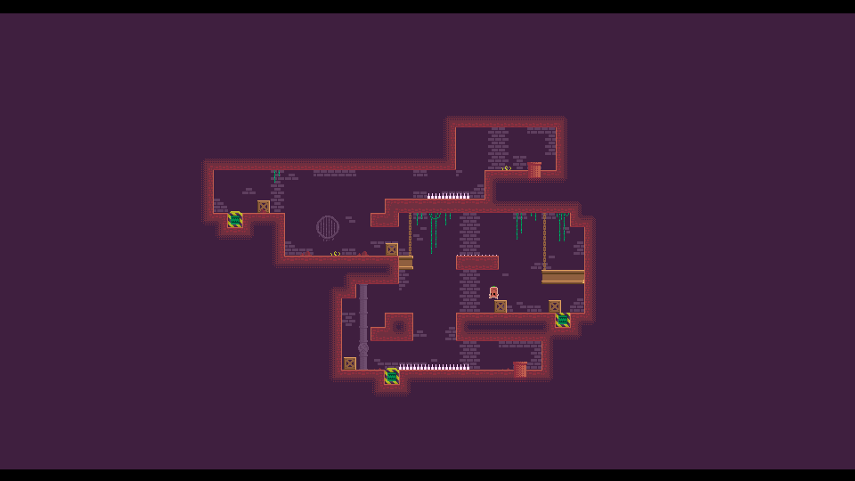
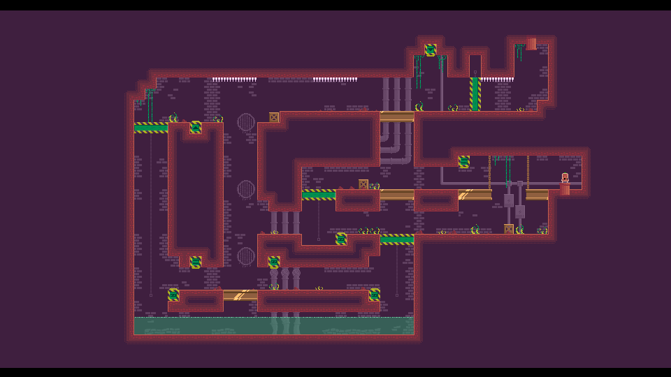
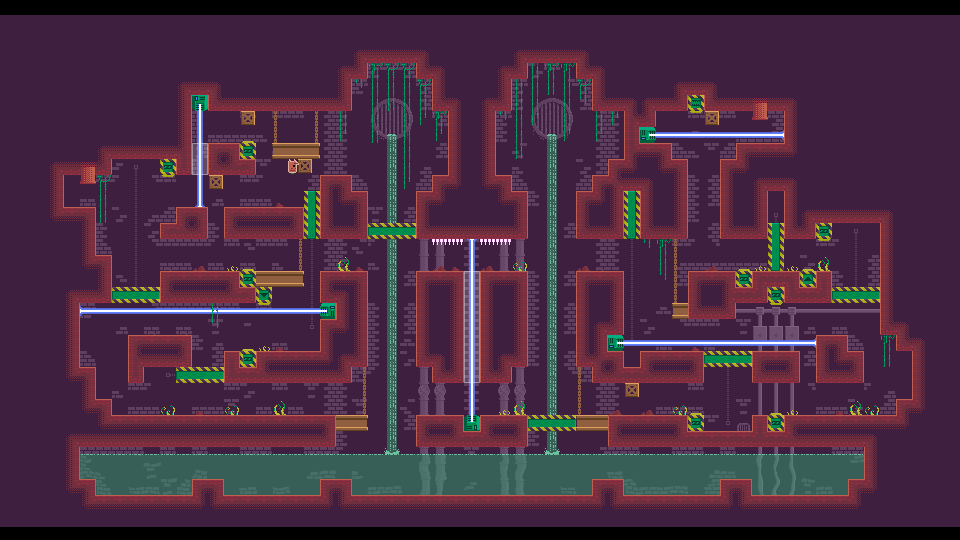

    

## Overview
Null is a 2D puzzle-platformer game where you arrange boxes to active/deactivate obstacles and reach designated goals.

Deep within an underground sewage network built by a lost civilization, a sweet potato struggles to survive. Determined not to rot in this hellscape, it decides that its fate will not be to perish there and embarks on a journey to reach the sunlight on the surface. But the journey proves to be far more challenging than it ever imagined.

Visit the game's [itch](https://monsdafur.itch.io/null) page!

## Screenshots

