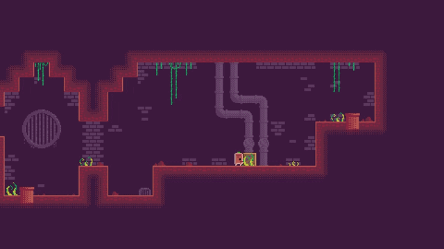
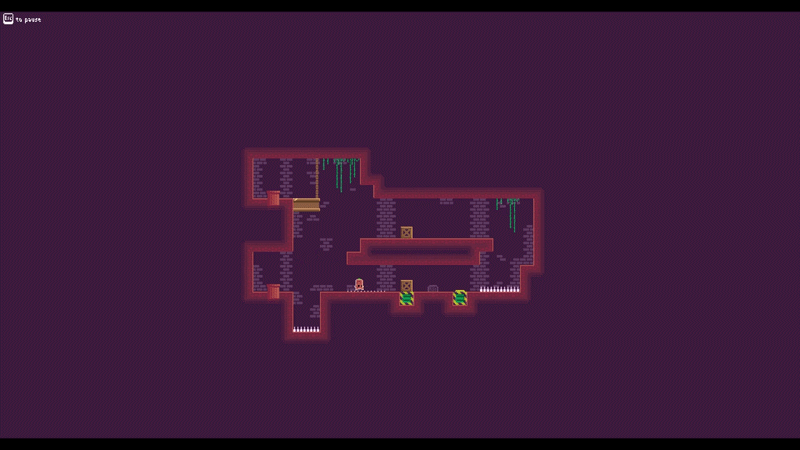
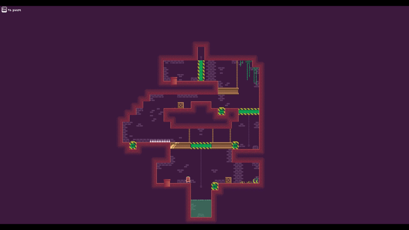
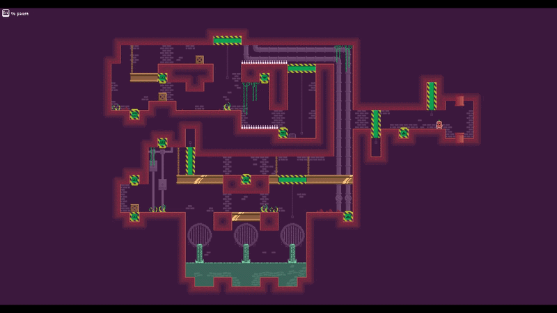
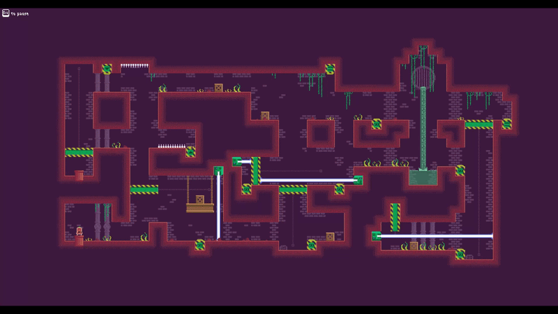

    

## Overview
Null is a 2D puzzle-platformer game where you arrange boxes to active/deactivate obstacles and reach designated goals.

Deep within an underground sewage network built by a lost civilization, a sweet potato struggles to survive. Determined not to rot in this hellscape, it decides that its fate will not be to perish there and embarks on a journey to reach the sunlight on the surface. But the journey proves to be far more challenging than it ever imagined.

**[Play the game on itch.io](https://monsdafur.itch.io/null)**

## Core Mechanics

* **Boxes:** Players can push boxes to reach higher platforms or activate switches.

  

* **Spike Traps:** Deadly obstacles that kill the player on contact. They can also be deactivated via connected switches.

  

* **Moving Tiles:** Moving platforms can function as elevators, doors, or transport platforms. Players can activate them using connected switches.

  

* **Gravity Reversal:** Instantly inverts gravity, fundamentally changing how puzzles are approached and solved.

  

* **Plasma Emitters:** Continuous plasma beams that can be blocked by moving platforms into their path or by using boxes as shields.

  

## Screenshots

